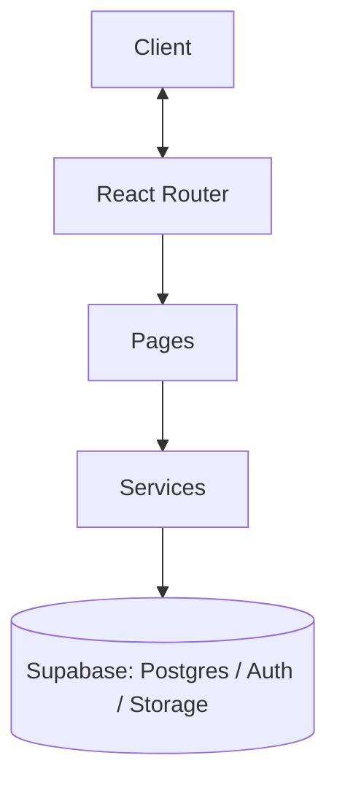
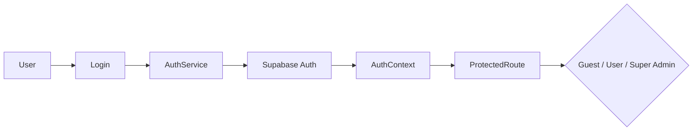

## watchUtopia Project Overview

🕰️ **Luxury Watch E-Commerce Platform**

---

## 📌 Problem (Core Idea)

Shopping for luxury watches online is usually scattered across marketplace listings, dealer sites, and inconsistent checkout flows, with no single place to browse curated inventory, track orders, and manage a wishlist.

➡️ **watchUtopia provides ONE storefront for browsing, buying, and managing luxury watches**, with a Supabase-backed admin side for catalog and order management.

---

## 🧑‍💻 Users

Role-based access is enforced via `AuthContext` + `ProtectedRoute`:

| Role                | Needs                                                              |
| ------------------- | ------------------------------------------------------------------- |
| Guest                | Browse products, view details, must authenticate to transact       |
| Registered User      | Shopping, cart, wishlist, checkout, order tracking, profile         |
| Super Admin          | Full product catalog management, order oversight, contact messages |

---

## ✨ Core Features

### A) Product Catalog

- Browse all watches (`ProductsPage`), view details (`WatchDetailsPage`)
- Featured brands and featured watches sections on the home page
- Products stored in Supabase `brands` table, images served from the `watches` storage bucket

### B) Shopping

- **Cart** — add/update/remove/clear items (`cartService` → `cart_items` table), custom events sync cart state across components
- **Wishlist** — add/remove/check items (`wishlistService` → `wishlist_items` table)
- **Checkout & Orders** — create orders, update shipping, track/delete orders (`orderService` → `orders` table)

### C) Authentication

- Supabase Auth (email/password) via `authService`
- Global session state in `AuthContext`
- `ProtectedRoute` gates cart, checkout, wishlist, orders, profile, and admin routes by auth + role

### D) Content & Support

- About Us, Shipping & Delivery info pages
- Contact form (`contactService` → `contact_messages` table)

### E) Admin (Super Admin only)

- Create, edit, delete products (`ProductEditPage`, `dataService`)
- Image upload/removal handled alongside product record updates
- Contact message handling, order oversight

---

## 🗄️ Data Model (Inferred from Service Layer)

> Inferred from `src/services/*` — no live schema/migration files exist in this repo, so this is a best-effort reconstruction, not an authoritative source of truth.

- **brands** — product/watch records (brand, name, price, image, etc.) — `dataService`
- **cart_items** — per-user cart line items — `cartService`
- **wishlist_items** — per-user saved watches — `wishlistService`
- **orders** — checkout orders, shipping info, status — `orderService`
- **contact_messages** — contact form submissions, with status — `contactService`
- **Storage bucket: `watches`** — product images, resolved via `imageService.getImageUrl()`
- **Auth** — Supabase Auth users, role distinguished via `AuthContext` (guest / registered / super admin)

---

## 🧱 Tech Stack

| Category      | Choice                              |
| ------------- | ------------------------------------ |
| Framework     | **React 19** + **Vite**              |
| Routing       | React Router v7 (`createBrowserRouter`) |
| Backend       | Supabase (PostgreSQL, Auth, Storage) |
| CSS/UI        | Tailwind CSS v4 + `@tailwindplus/elements` |
| Icons         | lucide-react                         |
| State         | React Context (auth) + local `useState`, no Redux |
| Lint          | ESLint 9                             |

---

## 🎨 UI / UX & Architecture

### Component Structure

```
src/
├── components/
│   ├── pages/       # Full page views (Home, Products, Cart, Checkout, ...)
│   ├── layout/       # Layout wrapper
│   ├── common/       # Reusable components (FeaturedBrands, FeaturedWatches)
│   └── profile/      # Role-based profile pages (Guest/User/SuperAdmin)
├── contexts/          # AuthContext (global auth state)
├── router/            # router.jsx, ProtectedRoute
├── services/          # api, auth, cart, contact, data, image, order, wishlist
└── utils/             # authUtils, formatters
```

### Key Decisions

- **Service layer** — all business logic/API calls live in dedicated services with a consistent success/error return shape; `dataService` acts as the central hub for product/brand CRUD.
- **Data flow** — User interaction → Component calls service → Service calls Supabase → State updates → UI re-renders (unidirectional, no Redux needed).
- **Routing tiers** — Public (home, products, product details, about, contact, shipping info), Auth (login, register), Protected (cart, checkout, wishlist, orders, profile), Admin (product create/edit/delete).

---

## 🔌 Architecture



---

## 🔐 Auth Flow



---

## 🧭 Roadmap & Status

No formal roadmap exists in the repo yet — this section is intentionally left as a placeholder rather than invented. Recent commit history shows active work on:

- Security hardening of Supabase-facing functions
- Removing duplicated components
- Bug fixes on product loading state

---

🏗️ **watchUtopia — Timeless Watches, Modern Storefront.**
